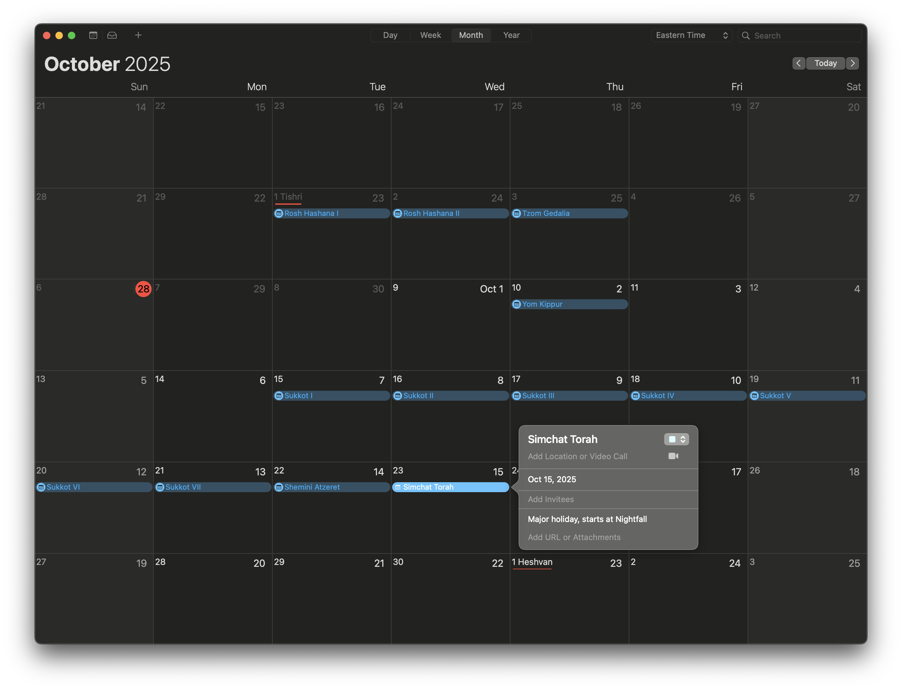

# conway

[](https://godocs.io/github.com/mendelmaleh/conway)

Based on Professor John A. Conway's [paper](files/conway-agus-slusky.pdf), with help from David Bendory's [implementation](https://github.com/bendory/conway-hebrew-calendar).

## cmd/ical

Generate an [iCalendar file](files/hebrew.ics) with the Hebrew Holidays:

```sh
go run ./cmd/ical -year 5786 -diaspora > files/hebrew.ics
```


